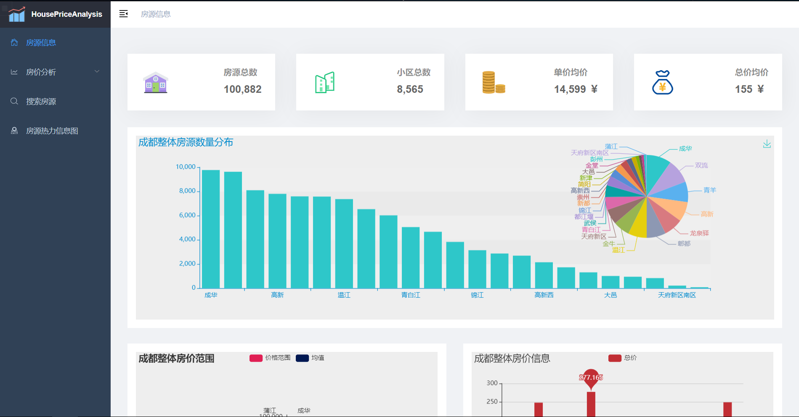
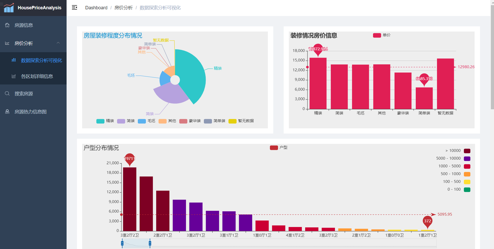
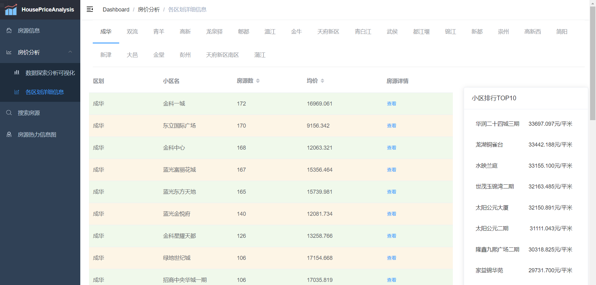
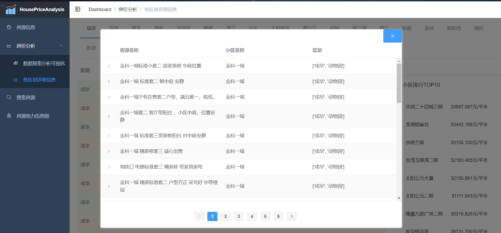
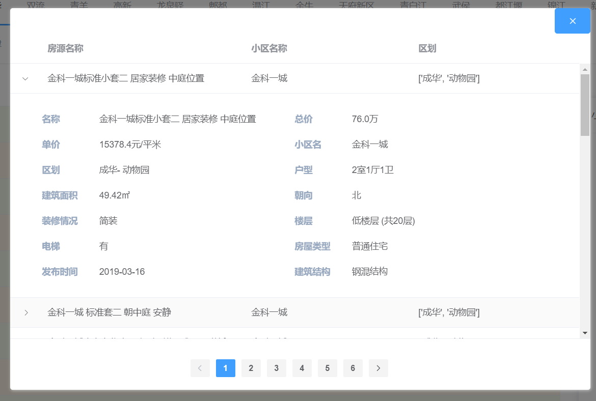
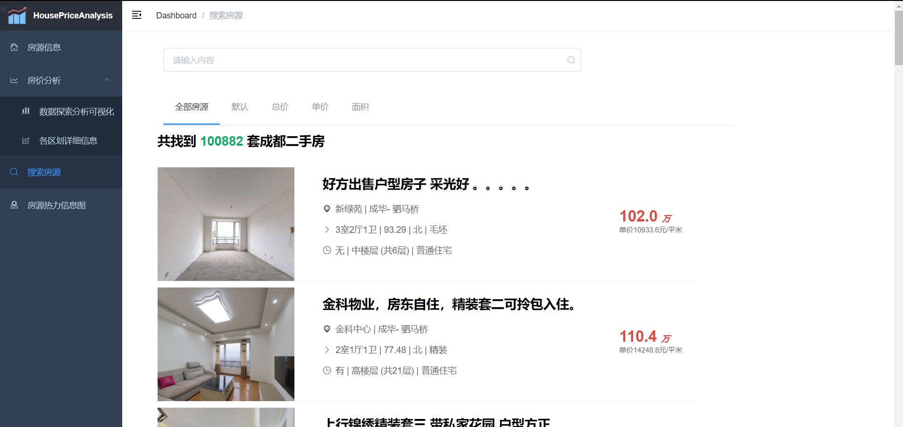
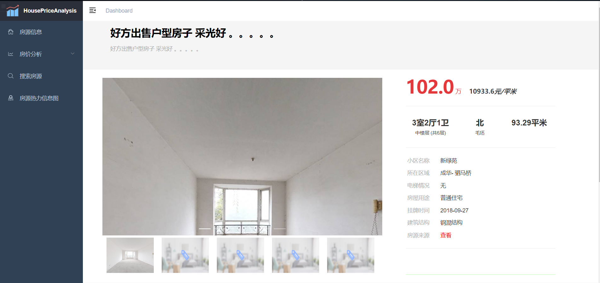
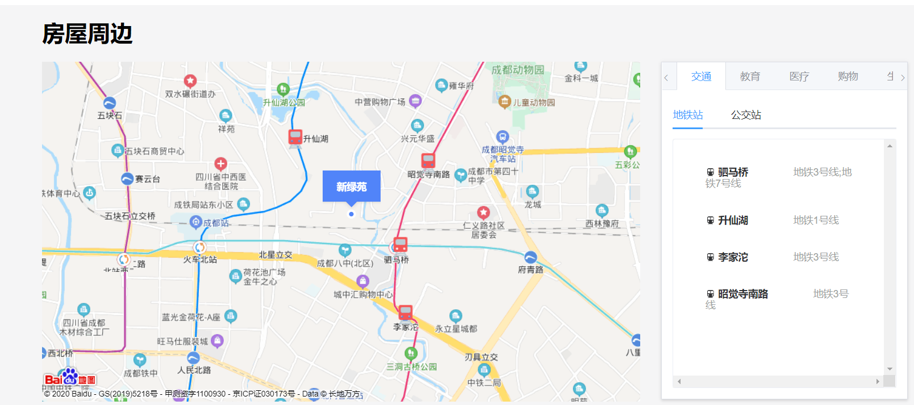
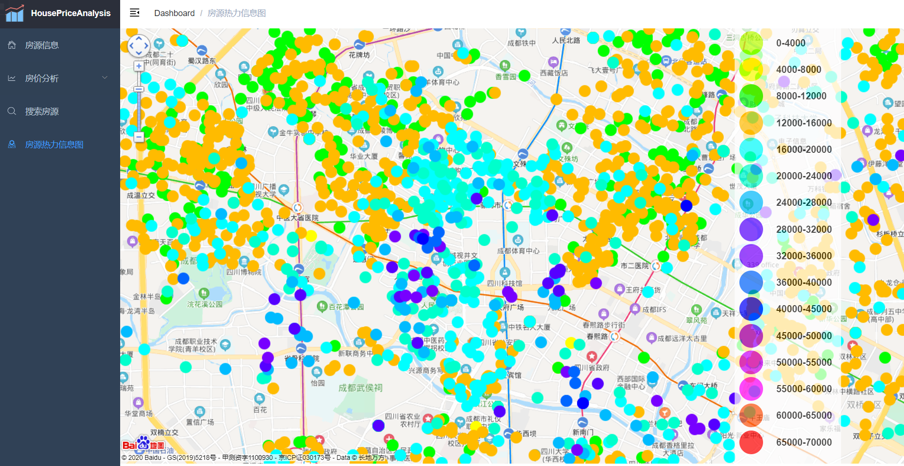

# HouseAnalysisWeb
基于joint-spider爬虫数据的Web端数据可视化平台

数据源来自项目 [Joint-spider][1] 

后端: django-restframework

前端: Vue

[1]: https://github.com/BetaCatPro/Joint-spiders

##### 前端页面展示

1. 房源信息页面

2. 房价分析-数据探索分析可视化页面

3. 房价分析-各区划详细信息页面

4. 区划小区详情

5. 小区房源列表详情

6. 搜索房源页面

7. 具体房源详情页面

8. 房屋周边

9. 房源热力信息图页面

=======

>>>>>>> dc555a143e8529f694d40994afb6058ad0dd8a37
